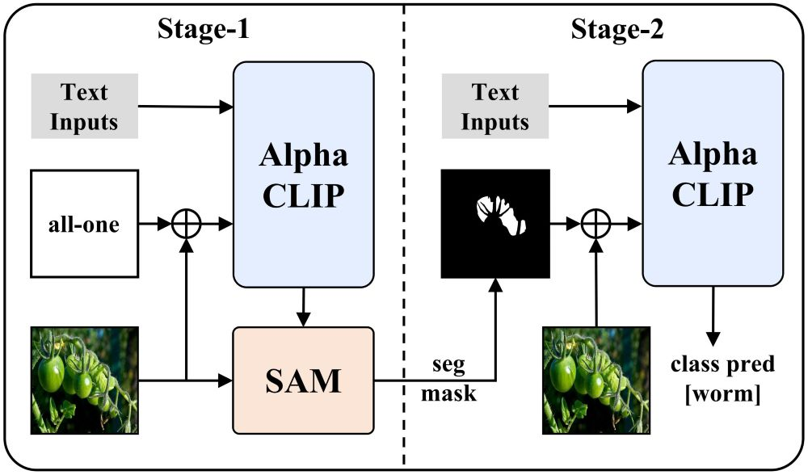
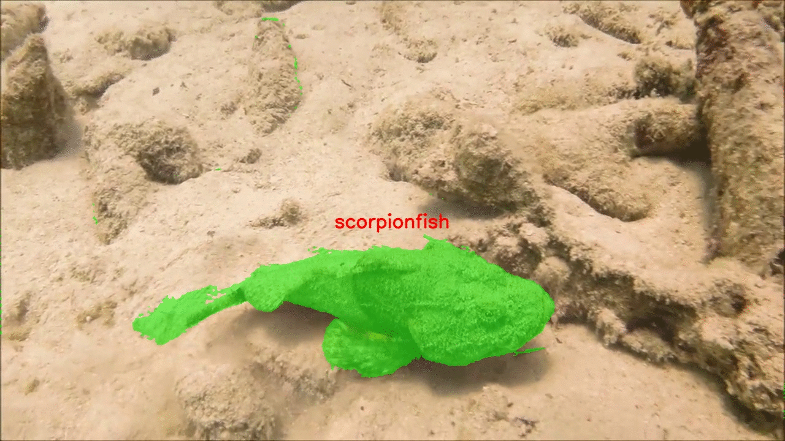
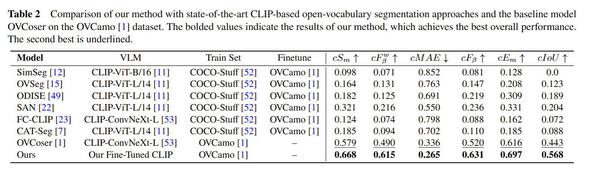

# Open-Vocabulary Camouflaged Object Segmentation with Cascaded Vision Language Models

[](https://arxiv.org/abs/2506.19300)


## Abstract Figure



## Prepare work

### Dataset

1. Download *OVCamo* dataset from [link](https://github.com/lartpang/OVCamo).
2. Change the dataset path in `./datasets/ovcamo_info/splitted_ovcamo.yaml`

### Pretrained model

- sam-vit-h-pth: [sam_vit_h_4b8939.pth](https://dl.fbaipublicfiles.com/segment_anything/sam_vit_h_4b8939.pth)

Put the *sam_vit_h_4b8939.pth*  in the folder `./pretrained`.


## Demo



- best_model_pth: [model_epoch_best.pth]( https://pan.baidu.com/s/1S6rWjBe-MNkV64t83nXKDQ?pwd=3zdc ). And put the *model_epoch_best.pth* in `./best_model_pth`.

```bash
python demo.py --img-path ./demo_img/scorpionfish.jpg --output-dir ./demo_img --config ./configs/demo.yaml --model ./best_model_pth/model_epoch_best.pth
```


## Train

### CLIP finetuing

*We will open source this code later.*

Ours finetuned_clip_pth: [model-best.pth.tar]( https://pan.baidu.com/s/1S6rWjBe-MNkV64t83nXKDQ?pwd=3zdc ). And put the *model-best.pth.tar* in `./pretrained`.

### Segmentation train

```bash
CUDA_VISIBLE_DEVICES=0,1 torchrun --nnodes 1 --nproc_per_node 2 train_ovcos_maskdecoder_edge.py --config ./configs/ovcos-sam-vit-h-maskdecoder-edge.yaml
```

- If you want train on more GPUs. Change the *CUDA_VISIBLE_DEVICES* and *nproc_per_node*.
- Train results will save in `./save`


## Eval

```bash
python test_ovcos_maskdecoder_edge.py --model ./save/*/model_epoch_best.pth
```

- Test results will save in `./eval_results`




